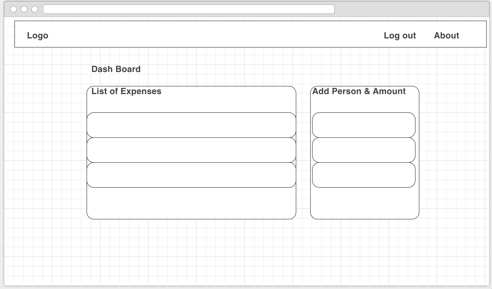

# ATL WDI Project #2 : Expen$e $hare App  
  
  
## **Overview:**  

Create a Expense Sharing application using Ruby on Rails. 

Demo: <https://morning-taiga-84371.herokuapp.com/>
	
## **Key Goals:**

- Take input from user and split expense evenly.
- Fully deployed in the web.
 
## **Planning**: 

Wireframe: 

[Trello Website](https://trello.com/b/nfEm0AEK/project-expense-share)

## **Tools Used:**

Ruby 2.2,
Rails 4.2,
PostgreSQL 9.4,
Twitter Bootstrap 3.3,
SASS 3.4,
bootstrap-generators 3.3,
HTML5, CSS3, jQuery, JavaScript,
Trello, Wireframe, SublimeText3, Google,

## **Bottle Necks:**

- Taking user input and sending the parameters to different pages.

## **Future Upgrade Plan:**

* Implement algorithm that assigns who to pay.

## **Lesson Learned:**  
 
 
- Plan ahead of details what you really want to create. 
- Start "Simple". Try to set small goals first and move on to the advance features.